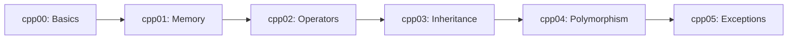

# 🚀 C++ Programming Modules (cpp00-cpp05)

<div align="center">


**A comprehensive C++ learning path covering fundamental to advanced OOP concepts**

[Overview](#-overview) • [Modules](#-modules) • [Installation](#-installation) • [Usage](#-usage) • [Concepts](#-key-concepts)

</div>

---

## 📖 Overview

This repository contains a progressive series of C++ modules (cpp00 through cpp05) designed to teach Object-Oriented Programming from the ground up. Each module introduces new concepts while building upon previous knowledge, following the **C++98 standard** with strict compilation flags.

### 🎯 Learning Objectives

- Master **memory management** (stack vs heap allocation)
- Understand **pointers and references**
- Implement **operator overloading**
- Apply **inheritance and polymorphism**
- Handle **exceptions** properly
- Write **robust, leak-free C++ code**

---

## 📂 Repository Structure

```
cpp/
├── cpp00/          # Introduction to C++, classes, and encapsulation
├── cpp01/          # Memory allocation, pointers, references, file I/O
├── cpp02/          # Ad-hoc polymorphism, operator overloading
├── cpp03/          # Inheritance and constructor chaining
├── cpp04/          # Subtype polymorphism, virtual functions, abstract classes
└── cpp05/          # Exception handling and RAII
```

---

## 📚 Modules

### **Module 00: Introduction to C++**
- Classes and objects
- Member functions
- Encapsulation
- Initialization and namespaces

### **Module 01: Memory & References**
<details>
<summary>Click to expand</summary>

**Topics covered:**
- **Stack vs Heap allocation** (`new` / `delete`)
- **Pointers vs References** (when to use each)
- **Dynamic arrays** (`new[]` / `delete[]`)
- **File I/O** with `std::ifstream` and `std::ofstream`
- **Member function pointers** for callback patterns

**Key exercises:**
- `ex00`: BraiiiiiiinnnzzzZ (stack vs heap zombies)
- `ex01`: Zombie horde (dynamic array allocation)
- `ex02`: Pointers and references
- `ex03`: HumanA vs HumanB (reference vs pointer design)
- `ex04`: File replace utility
- `ex05-06`: Harl complaint system (function pointers)

</details>

### **Module 02: Operator Overloading**
<details>
<summary>Click to expand</summary>

**Topics covered:**
- Orthodox Canonical Form
- Operator overloading (arithmetic, comparison, I/O)
- Fixed-point number implementation
- Copy constructor and assignment operator

</details>

### **Module 03: Inheritance**
<details>
<summary>Click to expand</summary>

**Topics covered:**
- Basic inheritance (`class Derived : public Base`)
- Constructor and destructor chaining
- Protected vs private members
- Inheritance hierarchy design

**Key exercises:**
- ClapTrap, ScavTrap, FragTrap hierarchy
- Understanding constructor call order

</details>

### **Module 04: Polymorphism**
<details>
<summary>Click to expand</summary>

**Topics covered:**
- **Virtual functions** and **virtual destructors**
- **Override** keyword
- **Pure virtual functions** (abstract classes)
- **Interfaces** in C++
- Runtime polymorphism

**Key exercises:**
- Animal, Dog, Cat hierarchy with `makeSound()`
- WrongAnimal example (non-virtual functions)
- Abstract Animal class
- Brain class and deep copying

**Example code:**
```cpp
class Animal {
protected:
    std::string type;
public:
    virtual ~Animal() {}  // Virtual destructor!
    virtual void makeSound() const = 0;  // Pure virtual
};

class Dog : public Animal {
public:
    void makeSound() const override {
        std::cout << "Woof!" << std::endl;
    }
};
```

</details>

### **Module 05: Exceptions**
<details>
<summary>Click to expand</summary>

**Topics covered:**
- **Exception handling** (try/catch/throw)
- **Custom exception classes** (inheriting from `std::exception`)
- **RAII** (Resource Acquisition Is Initialization)
- Exception safety guarantees
- `what()` function implementation

**Key exercises:**
- Bureaucrat class with grade validation
- Form signing system
- Exception propagation

**Example code:**
```cpp
class GradeTooHighException : public std::exception {
public:
    virtual const char* what() const throw() {
        return "Grade too high!";
    }
};

void setGrade(int grade) {
    if (grade < 1)
        throw GradeTooHighException();
}
```

</details>

---

## 🛠️ Installation

### Prerequisites
- **C++ compiler** with C++98 support (g++, clang++)
- **Make** (for building)

### Clone the Repository
```bash
git clone https://github.com/aybouatr/cpp.git
cd cpp
```

---

## 🚀 Usage

Each module/exercise has its own Makefile. Navigate to the desired exercise and build:

```bash
# Example: Building cpp01/ex00
cd cpp01/ex00
make
./BraiiiiiiinnnzzzZ

# Clean up
make fclean
```

### Makefile Commands
| Command | Description |
|---------|-------------|
| `make` | Compile the project |
| `make clean` | Remove object files |
| `make fclean` | Remove all generated files |
| `make re` | Rebuild from scratch |

---

## 🔑 Key Concepts

### 1. **Memory Management**
```cpp
// Stack allocation (automatic cleanup)
Zombie zombie("Foo");

// Heap allocation (manual cleanup required)
Zombie* zombie = new Zombie("Bar");
delete zombie;

// Array allocation
Zombie* horde = new Zombie[10];
delete[] horde;
```

### 2. **References vs Pointers**
| Feature | Reference | Pointer |
|---------|-----------|---------|
| Null value | ❌ Cannot be null | ✅ Can be null |
| Reassignment | ❌ Cannot be reassigned | ✅ Can be reassigned |
| Syntax | `Type&` | `Type*` |
| Initialization | **Must** be initialized | Can be initialized later |

### 3. **Virtual Functions**
```cpp
class Base {
public:
    virtual ~Base() {}  // Always virtual destructor!
    virtual void func() { cout << "Base"; }
};

class Derived : public Base {
public:
    void func() override { cout << "Derived"; }
};

Base* ptr = new Derived();
ptr->func();  // Prints "Derived" (polymorphism!)
delete ptr;   // Calls Derived destructor (because virtual)
```

### 4. **Orthodox Canonical Form**
Every class should have:
```cpp
class MyClass {
public:
    MyClass();                           // Default constructor
    MyClass(const MyClass& other);       // Copy constructor
    MyClass& operator=(const MyClass&);  // Copy assignment
    ~MyClass();                          // Destructor
};
```

### 5. **Exception Handling**
```cpp
try {
    Bureaucrat b("Bob", 0);  // Throws exception
} catch (const std::exception& e) {
    std::cerr << e.what() << std::endl;
}
```

---

## 📊 Compilation Flags

All projects use strict compilation:
```makefile
CXXFLAGS = -Wall -Wextra -Werror -std=c++98
```

- `-Wall`: Enable all warnings
- `-Wextra`: Enable extra warnings
- `-Werror`: Treat warnings as errors
- `-std=c++98`: Use C++98 standard

---

## 🎓 Learning Path



### Recommended Order:
1. **cpp00**: Get comfortable with classes and basic syntax
2. **cpp01**: Master memory management before moving forward
3. **cpp02**: Understand operator overloading
4. **cpp03**: Learn inheritance patterns
5. **cpp04**: Master polymorphism (most important!)
6. **cpp05**: Handle errors gracefully

---

## 📝 Code Style

This repository follows:
- **42 School Norm** (header comments, naming conventions)
- **RAII principles** (Resource Acquisition Is Initialization)
- **Const correctness** (`const` member functions where appropriate)
- **No memory leaks** (verified with `valgrind`)

---

## 🐛 Testing

Run with memory leak detection:
```bash
valgrind --leak-check=full ./your_program
```

---

## 🤝 Contributing

This is an educational repository. Feel free to:
- ⭐ Star the repo if you find it helpful
- 🐛 Report issues or bugs
- 💡 Suggest improvements

---

## 📚 Resources

- [cppreference.com](https://en.cppreference.com/) - C++ reference
- [LearnCpp.com](https://www.learncpp.com/) - Comprehensive C++ tutorial
- [C++ Core Guidelines](https://isocpp.github.io/CppCoreGuidelines/) - Best practices
- [Effective C++](https://www.aristeia.com/books.html) - Scott Meyers book series

---

## 📄 License

This project is part of the 42 School curriculum.

---

## 👤 Author

**aybouatr**
- GitHub: [@aybouatr](https://github.com/aybouatr)

---

<div align="center">

**Made with ❤️ as part of the 42 School curriculum**

[](https://42.fr/)

</div>
